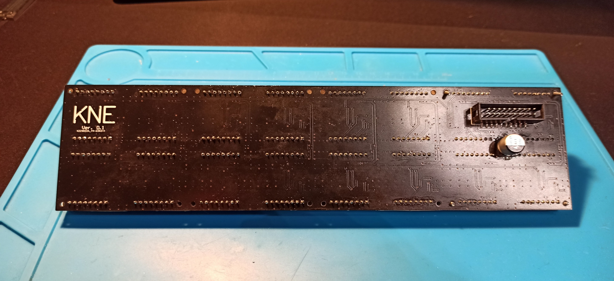

# matrix-display
Industrial display design with very good readability even for a user at a considerable distance. The display is built with 16 8x8 pixel dot matrices with dimensions of 32x32mm. Each dot matrix is controlled aby dedicated MAX7219 driver. The controllers are connected in cascade, making control of the entire display possible using a single SPI line (MOSI, SCK, CS). The designed display measures 250mm by 64mm and is controlled by a PIC32MX470 microcontroller. The PCB design was created in Altium Designer. The software was written in C using the MPLABX IDE development environment.

