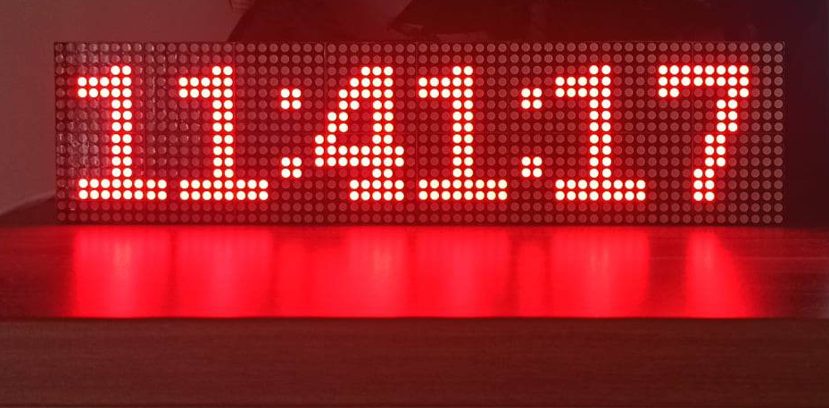
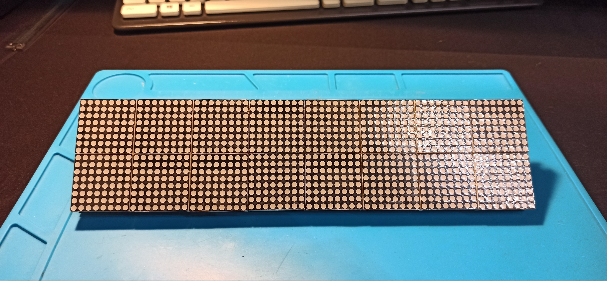

# matrix-display
The main design objective was to develop a display with very good readability even for a user at a considerable distance. The designed device can be part of an industrial machinery message display system. The display is built with 16 8x8 pixel dot matrix displays. For each indicator there is a dedicated MAX7219 controller. The controllers are connected in cascade, making control of the entire display possible using a single SPI line (MOSI, SCK, CS). The operation of the display is controlled by a PIC32MX470 microcontroller. The PCB design was created in Altium Designer. The software was written in C using the MPLABX IDE development environment.

